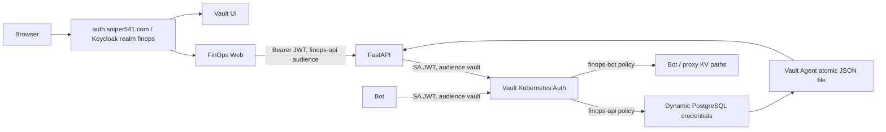

# Stage 16: shared SSO and Vault

## Architecture



Issuer is `https://auth.sniper541.com/realms/finops`. Public `finops-web` uses
Authorization Code + PKCE S256; tokens remain in memory. Confidential `finops-bot`
uses its service role and confidential `vault` uses browser OIDC. Password grants
remain disabled for application clients. Registration/recovery availability was
not changed. The theme is neutral Sniper541; `finops` remains an internal theme
folder name. API validates issuer, RS256/JWKS, expiration, subject and audience.
No client-selected user_id or bypass to the former demo account was introduced.

Vault OIDC requires `vault/vault-admin`, mapped to a dedicated `vault_roles`
ID-token claim and bound alongside audience `vault`. The real designated admin
is `mikhail`. Temporary test identities have been removed. The broad homelab
administrator policy is intentional: administrators can manage/read secrets;
ordinary FinOps users cannot sign in as Vault administrators.

The stock Vault OIDC login is visible by default through supported
`listing_visibility=unauth`; no UI patch or Enterprise feature is used. Its
logout clears the UI session but did not call token revocation in browser tests.
Keycloak SSO remains active, so OIDC relogin may not prompt for a password. Use
the explicit Revoke token action when revocation is needed. Vault tokens have
one-hour TTL and four-hour maximum; emergency root is not the daily login path.

## Operations

See [Vault runbook](../infrastructure/vault/README.md) for policies, database
privileges, audit, backup, restore and unseal. Reconcile reviewed settings with:

```sh
python3 infrastructure/vault/configure.py --workloads
python3 infrastructure/vault/configure.py --database
python3 infrastructure/vault/configure.py --oidc-access
python3 infrastructure/vault/configure.py --audit
```

Tokens are entered through hidden prompts. `--sso` is a coordinated issuer
cutover operation, not a routine bootstrap step. No Python environment is needed
for these standard-library scripts; Node/npm never needs `.venv`.

Helm owns Vault runtime; Argo owns Vault ingress/audit PVC and FinOps workloads.
Do not activate the staged optimized-image Keycloak Argo application. Neutral
theme files are separately mounted read-only using `deploy_theme.py` after
theme smoke and repository Security checks. The runtime image stays unchanged.

## Validation and limitations

- Production API smoke: real PKCE tokens for two temporary users, tenant
  isolation, rejected user_id overrides, service/browser separation, refresh and
  logout; original users and records preserved.
- Chrome: FinOps login/error/Bearer requests/reload/second-tab SSO/logout/relogin,
  zero JavaScript errors; desktop/mobile theme layout checked.
- Chrome: ordinary user denied Vault, administrator OIDC return, policies and
  engines visible, logout/SSO relogin and mobile login checked.
- Dynamic DB user: connect/data rights, denied DDL and migration-table access,
  TTL/renewal and rejected connection after revocation.
- Vault roles: wrong SA, namespace, audience and invalid JWT rejected; backend
  and bot denied each other's secret paths.
- 20 Web tests and build passed; six new credential rotation/fail-closed tests
  passed, plus complete backend/bot CI and repository Security.
- Vault restarted/unsealed, persistent audit HMAC observed, final encrypted Raft
  snapshot saved off-node with matching SHA256, initialization file removed.
- The former app-domain auth ingress/application is retired after canonical
  browser tests; its TLS Secret is retained.

Remaining acceptance: real Telegram `/start` confirmation and approval to test
and enable the prepared audit rotation timer. Automated off-node scheduling and
a restore drill are future work; a manual off-node snapshot tool and restore
procedure are supplied. Single-node/local-path is not HA; internal HTTP and lack
of enforced NetworkPolicy remain explicit infrastructure limitations. No fake
auto-unseal: three externally held Shamir shares are required after restart.

Keycloak custom-image publication remains blocked by the enforced scan. The
observed findings are Netty CVE-2026-75595 (critical, runtime still affected) and
the previously documented mssql-jdbc CVE-2025-59250 metadata finding. No ignore or
scan bypass was added, and deploying the theme does not fix the runtime CVE.
